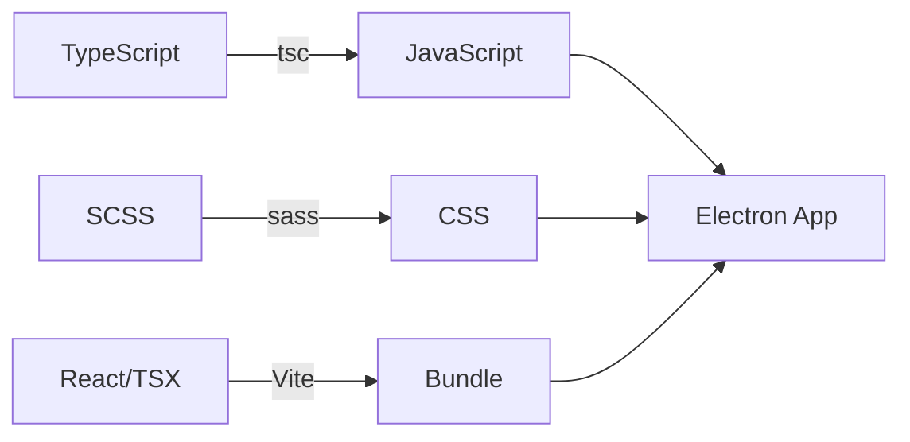
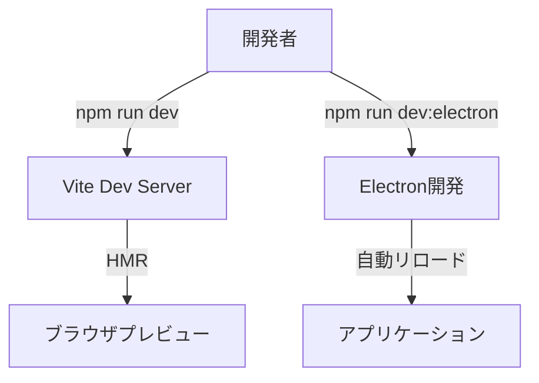

# 技術仕様書

## 1. テクノロジースタック

### コアテクノロジー

| カテゴリ | 技術 | バージョン | 用途 |
|---------|------|-----------|------|
| ランタイム | Node.js | 18.x LTS | サーバーサイド処理 |
| フレームワーク | Electron | 最新安定版 | デスクトップアプリ基盤 |
| UIライブラリ | React | 18.x | ユーザーインターフェース |
| 言語 | TypeScript | 5.x | 型安全なコーディング |
| スタイリング | SCSS | 最新版 | CSS拡張・スタイル管理 |

### 開発ツール

| ツール | 用途 |
|--------|------|
| Vite | ビルドツール・開発サーバー |
| ESLint | コード品質チェック |
| Prettier | コードフォーマット |
| electron-builder | アプリパッケージング |

### 主要ライブラリ

| ライブラリ | 用途 |
|-----------|------|
| react-router-dom | ページルーティング |
| systeminformation | システム情報取得 |
| sass | SCSS コンパイル |

## 2. アーキテクチャパターン

### Electronアーキテクチャ

```
┌─────────────────────────────────────────────────────────┐
│                    Electron App                         │
├─────────────────────────────────────────────────────────┤
│                                                         │
│  ┌─────────────────┐         ┌─────────────────┐       │
│  │  Main Process   │         │ Renderer Process │       │
│  │  (Node.js)      │◄──IPC──►│    (Chromium)    │       │
│  │                 │         │                  │       │
│  │  - Window管理    │         │  - React App     │       │
│  │  - システムAPI   │         │  - UI表示        │       │
│  │  - ファイルI/O   │         │  - ユーザー操作   │       │
│  └─────────────────┘         └─────────────────┘       │
│           │                          ▲                  │
│           │                          │                  │
│           ▼                          │                  │
│  ┌─────────────────────────────────────┐               │
│  │          Preload Script             │               │
│  │   (contextBridge で安全にAPI公開)    │               │
│  └─────────────────────────────────────┘               │
│                                                         │
└─────────────────────────────────────────────────────────┘
```

### セキュリティモデル

```typescript
// main.ts - BrowserWindow設定
const mainWindow = new BrowserWindow({
  webPreferences: {
    nodeIntegration: false,        // Node.js直接アクセス禁止
    contextIsolation: true,        // コンテキスト分離有効
    preload: path.join(__dirname, 'preload.js'),
    sandbox: true                  // サンドボックス有効
  }
});
```

## 3. プロジェクト構成

### ビルドパイプライン



### 開発環境フロー



## 4. 技術的制約と要件

### 必須要件

| 要件 | 説明 |
|------|------|
| Node.js 18+ | ES2022+機能の使用 |
| Electron 25+ | 最新セキュリティ機能 |
| TypeScript 厳格モード | strict: true 必須 |
| SCSS | CSSの直接記述は禁止 |

### セキュリティ要件

| 項目 | 設定 |
|------|------|
| nodeIntegration | false |
| contextIsolation | true |
| sandbox | true（推奨） |
| webSecurity | true |
| **インターネットアクセス** | **禁止** |

### インターネットアクセス禁止ポリシー

**重要**: このアプリケーションはローカルで動作するElectronアプリであり、システム情報に関する重要な操作を行うため、セキュリティの観点からインターネットへのアクセスを禁止します。

#### 禁止事項

| 禁止事項 | 説明 |
|----------|------|
| 外部API呼び出し | fetch, axios, http/https リクエストの使用禁止 |
| 外部リソース読み込み | CDNからのスクリプト・スタイル・フォント読み込み禁止 |
| テレメトリ・分析 | 外部への使用状況データ送信禁止 |
| 自動更新チェック | インターネット経由のアップデート確認禁止 |
| 外部認証 | OAuth等の外部認証サービス利用禁止 |

#### 許可事項

| 許可事項 | 説明 |
|----------|------|
| ローカルファイルアクセス | ローカルファイルシステムへのアクセス |
| システムAPI呼び出し | OS API、systeminformation ライブラリ |
| IPC通信 | Main Process と Renderer Process 間の通信 |
| ローカルリソース | アプリに同梱されたリソースの使用 |

#### Electronでの強制設定

```typescript
// main.ts - インターネットアクセスをブロック
const mainWindow = new BrowserWindow({
  webPreferences: {
    nodeIntegration: false,
    contextIsolation: true,
    preload: path.join(__dirname, 'preload.js'),
    sandbox: true
  }
});

// 外部URLへのナビゲーションをブロック
mainWindow.webContents.on('will-navigate', (event, url) => {
  if (!url.startsWith('file://')) {
    event.preventDefault();
  }
});

// 新しいウィンドウ（外部リンク）をブロック
mainWindow.webContents.setWindowOpenHandler(() => {
  return { action: 'deny' };
});
```

### ファイル分離要件

| 種類 | 拡張子 | 配置 |
|------|--------|------|
| 構造 | .html | src/renderer/ |
| ロジック | .tsx | src/renderer/components/ |
| スタイル | .scss | src/renderer/styles/ |

## 5. パフォーマンス要件

### アプリケーションパフォーマンス

| 指標 | 目標値 | 測定方法 |
|------|--------|---------|
| 起動時間（スプラッシュまで） | < 2秒 | タイムスタンプ計測 |
| 起動時間（Mainページまで） | < 5秒 | タイムスタンプ計測 |
| アイドル時CPU使用率 | < 5% | タスクマネージャー |
| 監視中CPU使用率 | < 10% | タスクマネージャー |
| メモリ使用量 | < 200MB | タスクマネージャー |

### レンダリングパフォーマンス

| 指標 | 目標値 |
|------|--------|
| アニメーションFPS | 30fps以上 |
| UIレスポンス時間 | < 100ms |
| データ更新間隔 | 1秒 |

### 最適化戦略

1. **コード分割**
   - ページ単位のlazy loading
   - 必要なコンポーネントのみ読み込み

2. **メモ化**
   - React.memoによる再レンダリング防止
   - useMemoによる計算結果キャッシュ

3. **バックグラウンド処理**
   - 監視処理はMain Processで実行
   - IPCでUI更新のみRenderer Processへ

## 6. 開発・ビルドコマンド

### 開発コマンド

```bash
# 依存関係インストール
npm install

# 開発サーバー起動（ブラウザ）
npm run dev:browser

# Electron開発モード
npm run dev:electron

# 型チェック
npm run type-check

# Lint実行
npm run lint

# Lint自動修正
npm run lint:fix
```

### ビルドコマンド

```bash
# 本番ビルド
npm run build

# Electronアプリビルド
npm run build:electron

# パッケージング（Windows）
npm run package:win

# パッケージング（macOS）
npm run package:mac

# パッケージング（Linux）
npm run package:linux
```

## 7. 依存関係管理

### package.json 構成例

```json
{
  "name": "ili-system",
  "version": "1.0.0",
  "main": "dist/main/main.js",
  "scripts": {
    "dev:browser": "vite",
    "dev:electron": "npm run build && electron .",
    "build": "tsc && vite build",
    "type-check": "tsc --noEmit",
    "lint": "eslint src --ext .ts,.tsx"
  },
  "dependencies": {
    "react": "^18.x",
    "react-dom": "^18.x",
    "react-router-dom": "^6.x",
    "systeminformation": "^5.x"
  },
  "devDependencies": {
    "electron": "^28.x",
    "electron-builder": "^24.x",
    "typescript": "^5.x",
    "vite": "^5.x",
    "@vitejs/plugin-react": "^4.x",
    "sass": "^1.x",
    "eslint": "^8.x",
    "@typescript-eslint/eslint-plugin": "^6.x",
    "@typescript-eslint/parser": "^6.x"
  }
}
```

## 8. 環境設定

### TypeScript設定（tsconfig.json）

```json
{
  "compilerOptions": {
    "target": "ES2022",
    "module": "ESNext",
    "moduleResolution": "bundler",
    "strict": true,
    "jsx": "react-jsx",
    "esModuleInterop": true,
    "skipLibCheck": true,
    "forceConsistentCasingInFileNames": true,
    "resolveJsonModule": true,
    "declaration": true,
    "declarationMap": true,
    "sourceMap": true
  }
}
```

### Electron Builder設定

```json
{
  "appId": "com.aegissystem.app",
  "productName": "AEGISSystem",
  "directories": {
    "output": "release"
  },
  "files": [
    "dist/**/*"
  ],
  "win": {
    "target": "nsis",
    "icon": "assets/icon.ico"
  },
  "mac": {
    "target": "dmg",
    "icon": "assets/icon.icns"
  },
  "linux": {
    "target": "AppImage",
    "icon": "assets/icon.png"
  }
}
```
