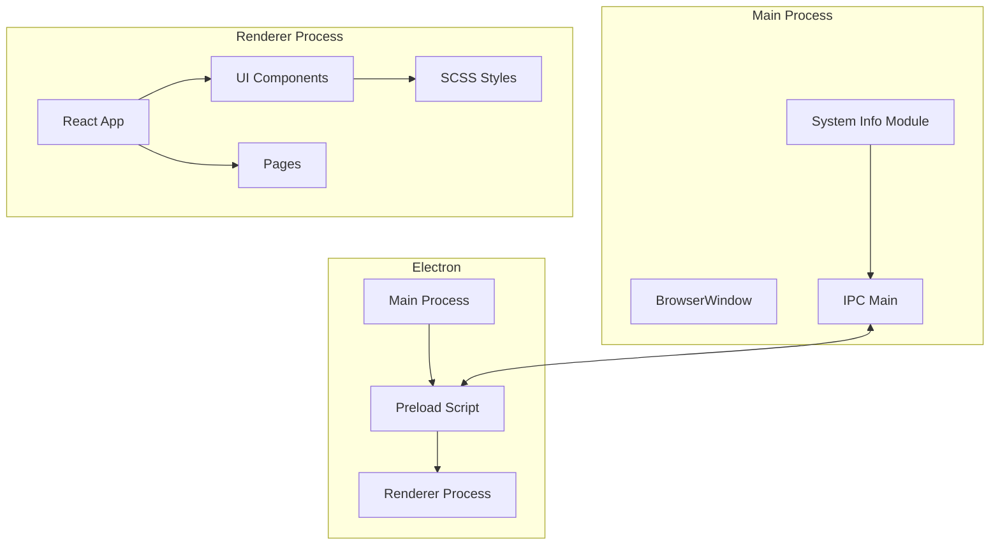
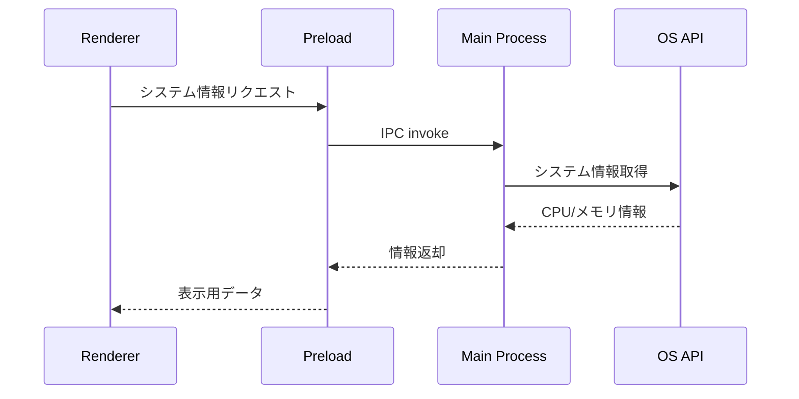
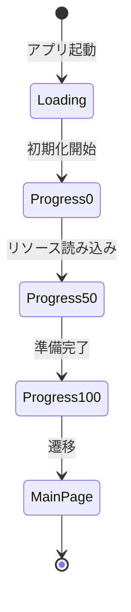
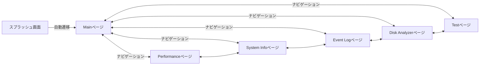
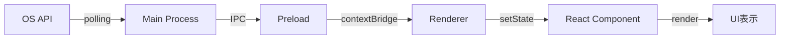

# 機能設計書

## 1. システム構成図

### 全体アーキテクチャ



### プロセス間通信



## 2. 機能ごとのアーキテクチャ

### 2.1 スプラッシュ画面



**コンポーネント構成:**
- `SplashWindow` - スプラッシュ用のBrowserWindow
- `SplashScreen` - Reactコンポーネント
- `CircularProgress` - 円形プログレスバー

### 2.2 Mainページ

**機能:**
- アプリケーションのハブとして機能
- 各ページへのナビゲーション
- 背景アニメーションの表示

**コンポーネント構成:**
- `MainPage` - メインページコンテナ
- `Sidebar` - サイドバーナビゲーション（VSCode風シンプルデザイン）
- `CyberBackground` - ドーナツ型回転背景（PNG、3層非重複）

### 2.3 Performanceページ

**機能:**
- CPU使用率のリアルタイム表示
- メモリ使用量のリアルタイム表示
- GPU使用率のリアルタイム表示
- タスクマネージャ風グラフによる可視化（固定X軸60点、左スクロール）

**コンポーネント構成:**
- `PerformancePage` - ページコンテナ
- `CPUUsage` - CPU監視コンポーネント
- `MemoryUsage` - メモリ監視コンポーネント
- `GPUUsage` - GPU監視コンポーネント
- `PerformanceChart` - リアルタイムグラフ表示（Highcharts）
- `ProcessList` - プロセスリスト

### 2.4 System Infoページ

**機能:**
- OS情報の表示（ディストリビューション、バージョン、アーキテクチャ、ホスト名）
- CPU詳細情報の表示（メーカー、モデル、速度、コア数）
- メモリモジュール情報の表示（容量、タイプ、速度、メーカー）
- ストレージデバイス情報の表示（名前、容量、タイプ、ベンダー）
- マザーボード・BIOS情報の表示

**コンポーネント構成:**
- `SystemInfoPage` - ページコンテナ
- サマリーカード（OS、CPU、メモリ、ストレージ）
- タブ切り替え（Overview、Hardware、Storage）
- 情報グリッド

### 2.5 Event Logページ

**機能:**
- Windowsイベントログの表示
- レベル別フィルタリング（Error、Warning、Information）
- カテゴリ別フィルタリング（Application、System）
- テキスト検索
- イベント詳細の展開表示

**コンポーネント構成:**
- `EventLogPage` - ページコンテナ
- サマリーカード（エラー数、警告数、情報数）- クリックでフィルタ
- 検索ボックス
- フィルターコントロール
- イベントリスト（展開可能な詳細表示）

### 2.6 Disk Analyzerページ

**機能:**
- ストレージドライブ一覧の表示
- 使用状況のプログレスバー表示（色分け: 90%以上赤、70%以上黄）
- ファイルタイプ別使用量分析
- 大容量ファイルリストの表示

**コンポーネント構成:**
- `DiskAnalyzerPage` - ページコンテナ
- ドライブカード（選択可能）
- ファイルタイプパネル（アイコン付き）
- 大容量ファイルパネル（ランキング表示）
- サマリーセクション（総容量、使用量、空き容量、ドライブ数）

### 2.7 カスタムウィンドウコントロール

**機能:**
- ウィンドウのドラッグ移動
- 最小化/最大化/閉じる操作

**コンポーネント構成:**
- `TitleBar` - タイトルバーコンテナ
- `WindowControls` - ウィンドウ操作ボタン群

## 3. コンポーネント設計

### コンポーネント階層

```
App
├── WindowControls (VSCode風ボーダーレスデザイン)
│   └── title-bar
│       ├── app-title ("AEGIS System")
│       └── window-controls
│           ├── minimize (ホバー: 背景色変化)
│           ├── maximize (ホバー: 背景色変化)
│           └── close (ホバー: 赤背景)
├── CyberBackground (PNG、4層ドーナツ型)
│   ├── pattern-1 (外側: 1800×1800, 60s正転) - v3: ランダム弧配置
│   ├── pattern-2 (中間: 600×600, 45s逆転)
│   ├── pattern-4 (弧: 1300×1300, 12s正転) - 対向1/6弧
│   └── pattern-3 (内側: 800×800, 75s正転)
├── Sidebar (220px幅、VSCode風)
│   ├── sidebar-nav
│   │   ├── nav-item (Main)
│   │   ├── nav-item (Performance)
│   │   ├── nav-item (System Info)
│   │   ├── nav-item (Event Log)
│   │   ├── nav-item (Disk Analyzer)
│   │   └── nav-item (Test)
│   └── sidebar-footer
│       ├── Settings
│       └── status (Online)
└── PageContainer (max-width: 1400px)
    ├── MainPage
    │   └── page-header + page-title
    ├── PerformancePage
    │   ├── page-header + page-title
    │   ├── PerformanceChart (CPU/Memory/GPU)
    │   ├── CPUUsage
    │   ├── MemoryUsage
    │   ├── GPUUsage
    │   └── ProcessList
    ├── SystemInfoPage
    │   ├── page-header + page-title + refresh-button
    │   ├── summary-cards
    │   └── tabs (Overview/Hardware/Storage)
    ├── EventLogPage
    │   ├── page-header + page-title + refresh-button
    │   ├── summary-cards (クリックでフィルタ)
    │   ├── search-box + filters
    │   └── event-list (展開可能)
    ├── DiskAnalyzerPage
    │   ├── page-header + page-title + refresh-button
    │   ├── drives-grid
    │   ├── file-types-panel
    │   ├── large-files-panel
    │   └── summary-section
    └── TestPage
        └── page-header + page-title
```

### 共通コンポーネント

| コンポーネント名 | 役割 | Props |
|-----------------|------|-------|
| CyberBackground | ドーナツ型回転背景（PNG） | - |
| CircularProgress | 円形プログレス | value, size, strokeWidth |
| PerformanceChart | パフォーマンスグラフ | data, label, color |
| WindowControls | ウィンドウ操作（VSCode風） | - |
| Sidebar | サイドバーナビゲーション | - |

## 4. 画面遷移図



## 5. ワイヤフレーム

### 5.1 スプラッシュ画面

```
┌─────────────────────────────────────┐
│                                     │
│                                     │
│           ┌─────────┐               │
│           │  ○○○○   │               │
│           │ ○    ○  │  ← 円形プログレス
│           │ ○    ○  │               │
│           │  ○○○○   │               │
│           └─────────┘               │
│              75%                    │
│                                     │
│           AEGISSystem                 │
│                                     │
└─────────────────────────────────────┘
```

### 5.2 Mainページ

```
┌─────────────────────────────────────────────┐
│ AEGIS System                  ─  □  ×       │ ← タイトルバー (VSCode風)
├─────────────────────────────────────────────┤
│                                             │
│  ┌──────────┐                               │
│  │AEGIS      │                               │
│  │SYSTEM    │    ○ ○ ○ (ドーナツ型背景)    │
│  │          │    ○   ○                      │
│  │  Main    │    ○   ○ ← 4層非重複         │
│  │  Perf    │    ○ ○ ○                      │
│  │  SysInfo │                               │
│  │  EvtLog  │                               │
│  │  Disk    │                               │
│  │  Test    │                               │
│  │ Settings │                               │
│  │ ● Online │                               │
│  └──────────┘                               │
│    ↑ サイドバー (220px)                     │
└─────────────────────────────────────────────┘
```

### 5.3 Performanceページ

```
┌─────────────────────────────────────────────┐
│ ≡ AEGISSystem              [─] [□] [×]       │
├─────────────────────────────────────────────┤
│                                             │
│  ┌────────┐  ┌─────────────────────────┐   │
│  │ Main   │  │ CPU Usage         45%   │   │
│  │ Perf   │  │ ████████░░░░░░░░░░░░    │   │
│  │        │  │ [グラフ表示]            │   │
│  │        │  └─────────────────────────┘   │
│  │        │                                 │
│  │        │  ┌─────────────────────────┐   │
│  │        │  │ Memory          8.2 GB  │   │
│  │        │  │ ██████████████░░░░░░    │   │
│  └────────┘  │ [グラフ表示]            │   │
│              └─────────────────────────┘   │
└─────────────────────────────────────────────┘
```

## 6. データフロー

### パフォーマンスデータフロー



### データ構造

```typescript
// システム情報の型定義
interface SystemInfo {
  cpu: {
    usage: number;        // CPU使用率 (0-100)
    cores: number;        // コア数
    model: string;        // CPUモデル名
  };
  memory: {
    total: number;        // 総メモリ (bytes)
    used: number;         // 使用中メモリ (bytes)
    free: number;         // 空きメモリ (bytes)
    usagePercent: number; // 使用率 (0-100)
  };
}

// パフォーマンス履歴の型定義
interface PerformanceHistory {
  timestamp: number;
  cpuUsage: number;
  memoryUsage: number;
}
```

## 7. IPC API設計

### Main → Renderer (イベント)

| チャンネル名 | 説明 | ペイロード |
|-------------|------|-----------|
| `system:info` | システム情報更新 | `SystemInfo` |
| `window:maximized` | 最大化状態変更 | `boolean` |

### Renderer → Main (呼び出し)

| チャンネル名 | 説明 | パラメータ | 戻り値 |
|-------------|------|-----------|--------|
| `window:minimize` | ウィンドウ最小化 | - | `void` |
| `window:maximize` | ウィンドウ最大化 | - | `void` |
| `window:close` | ウィンドウを閉じる | - | `void` |
| `system:getInfo` | システム情報取得 | - | `SystemInfo` |
| `system:startMonitoring` | 監視開始 | `interval: number` | `void` |
| `system:stopMonitoring` | 監視停止 | - | `void` |

## 8. UIデザイン仕様

### カラーパレット

| 色名 | 用途 | HEX |
|------|------|-----|
| Primary | メインカラー | #00D9FF |
| Secondary | アクセント | #FF00AA |
| Background | 背景 | #0A0A0F |
| Surface | カード背景 | #1A1A2E |
| Text Primary | 主要テキスト | #FFFFFF |
| Text Secondary | 補助テキスト | #8888AA |
| Success | 正常状態 | #00FF88 |
| Warning | 警告状態 | #FFAA00 |
| Error | エラー状態 | #FF4444 |

### タイポグラフィ

| 要素 | フォント | サイズ | ウェイト |
|------|---------|-------|---------|
| H1 | システムフォント | 32px | 700 |
| H2 | システムフォント | 24px | 600 |
| H3 | システムフォント | 18px | 600 |
| Body | システムフォント | 14px | 400 |
| Caption | システムフォント | 12px | 400 |

### アニメーション

| 要素 | アニメーション | 時間 |
|------|--------------|------|
| 背景パターン1（外側） | 正転 | 60s/周 |
| 背景パターン2（中間） | 逆回転 | 45s/周 |
| 背景パターン4（弧） | 正転 | 12s/周 |
| 背景パターン3（内側） | 正転 | 75s/周 |
| プログレスバー | イージング | 0.3s |
| ページ遷移 | フェード | 0.2s |
| ホバー効果 | 背景色変化 | 0.15s |

### 背景パターン仕様

| パターン | ファイル名 | サイズ | 特徴 | 色 |
|----------|------------|--------|------|-----|
| パターン1（外側） | pattern-1-v3.png | 1800×1800 | ランダム弧配置、対称メモリ目盛り | #4dc9ff |
| パターン2（中間） | pattern-2-v2.png | 600×600 | ギア風パターン | #4dc9ff |
| パターン4（弧） | pattern-4.png | 1300×1300 | 対向1/6弧 | #4dc9ff |
| パターン3（内側） | pattern-3-v2.png | 800×800 | データセグメント付きリング | #4dc9ff |
